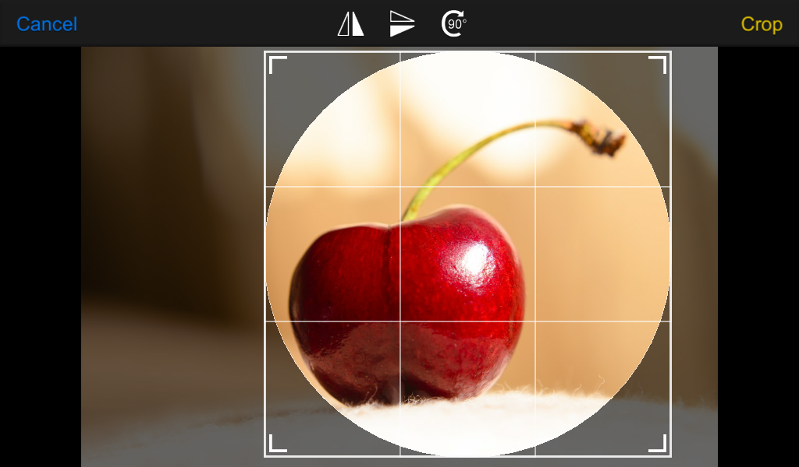

# Unity Image Cropper

**Available on Asset Store:** https://assetstore.unity.com/packages/tools/gui/image-cropper-116650

**Forum Thread:** https://forum.unity.com/threads/released-image-cropper-multiplatform-image-cropping-solution-with-oval-mask-support.526901/

**Discord:** https://discord.gg/UJJt549AaV

**WebGL Demo:** http://yasirkula.net/ImageCropperDemo/

**[Support the Developer ☕](https://yasirkula.itch.io/unity3d)**

## ABOUT

ImageCropper aims to be a powerful, customizable and easy-to-use image cropping solution for Unity 3D. It is created with Unity's UI system.

## FEATURES

- Supports rectangular and oval cropping modes
- Supports auto-zoom feature for fine-tuning the selection
- Costs 1 SetPass call and 6 batches (assuming that *Sprite Packing* is enabled in *Editor Settings*)
- Can work on pretty much any screen resolution/orientation

## INSTALLATION

There are 5 ways to install this plugin:

- import [ImageCropper.unitypackage](https://github.com/yasirkula/UnityImageCropper/releases) via *Assets-Import Package*
- clone/[download](https://github.com/yasirkula/UnityImageCropper/archive/master.zip) this repository and move the *Plugins* folder to your Unity project's *Assets* folder
- import it from [Asset Store](https://assetstore.unity.com/packages/tools/gui/image-cropper-116650)
- *(via Package Manager)* add the following line to *Packages/manifest.json*:
  - `"com.yasirkula.imagecropper": "https://github.com/yasirkula/UnityImageCropper.git",`
- *(via [OpenUPM](https://openupm.com))* after installing [openupm-cli](https://github.com/openupm/openupm-cli), run the following command:
  - `openupm add com.yasirkula.imagecropper`

## HOW TO

ImageCropper is a singleton object that can be accessed via `ImageCropper.Instance`. To start cropping a *Texture* object, you can call the following function:

`ImageCropper.Instance.Show( Texture image, CropResult onCrop, Settings settings = null, ImageResizePolicy croppedImageResizePolicy = null )`
- **image**: the Texture object to crop
- **onCrop**: callback that will be invoked after cropping is finished/cancelled. Its signature is as following: `void CropResult( bool result, Texture originalImage, Texture2D croppedImage )`. **result** stores whether the image is cropped successfully or operation is cancelled, **originalImage** stores the Texture passed as *image* parameter and **croppedImage** stores the resulting cropped image
- **croppedImageResizePolicy**: called before the cropped image is saved as Texture2D. Can be used to override the size of the Texture2D object. Its signature is as following: `void ImageResizePolicy( ref int width, ref int height )`, where *width* and *height* will initially be equal to the dimensions of the selection (crop area). If left *null*, texture's size will be equal to the selection's size. Can be used to e.g. always output a 256x256 Texture2D
- **settings**: can be used to adjust the parameters of the image cropper. Available parameters are:
  - **bool autoZoomEnabled** (*default=true*): if enabled, image cropper will zoom in to the selection (crop area) if it is too small, and zoom out if selection is too large
  - **bool pixelPerfectSelection** (*default=false*): if enabled, selection's position and size values will be rounded to the nearest integers. As a *RenderTexture* with a render camera is used to generate the cropped image (instead of reading the pixels of the source image), a pixel perfect selection doesn't really have a big impact on the output
  - **bool ovalSelection** (*default=false*): if enabled, an oval mask will be used to crop the image in oval/circular shape. Otherwise, image will be cropped in rectangular/square shape
  - **bool markTextureNonReadable** (*default=true*): marks the cropped texture as non-readable for better memory usage. If you plan to modify the texture later (e.g. *GetPixels/SetPixels*), set its value to *false*
  - **Color imageBackground** (*default=black*): determines the background color of the cropped image. Background color will be visible if source image has transparency or if *ovalSelection* is enabled. For a completely transparent background, set its value to *Color.clear* (which has 0 alpha). Note that if imageBackground is opaque (alpha=1), cropped texture will be in *RGB24* format instead of *RGBA32* format. As RGB24 uses less memory, try not to use a transparent background color unless it is needed
  - **Button visibleButtons** (*default=FlipHorizontal|FlipVertical|Rotate90Degrees*): determines which image orientation buttons will be visible in the user interface. By default, all buttons are visible
  - **Visibility guidelinesVisibility** (*default=AlwaysVisible*): determines the visibility of the selection guidelines. Accepted values are: *Hidden*, *OnDrag* (only visible while the selection is being dragged/resized) and *AlwaysVisible*
  - **Orientation initialOrientation** (*defaul=Normal*): initial orientation (flipped/rotated state) of the image. Please see EXIF orientations before changing its value: http://sylvana.net/jpegcrop/exif_orientation.html
  - **Vector2 selectionMinSize** (*default=0,0*): minimum size of the selection (crop area). If untouched, it will be equal to 1/10th of the source image's size
  - **Vector2 selectionMaxSize** (*default=0,0*): maximum size of the selection (crop area). If untouched, there will be no limit
  - **float selectionMinAspectRatio** (*default=0*): minimum aspect ratio of the selection (crop area). If untouched, there will be no limit
  - **float selectionMaxAspectRatio** (*default=0*): maximum aspect ratio of the selection (crop area). If untouched, there will be no limit. For a circular/square selection, you can set both *selectionMinAspectRatio* and *selectionMaxAspectRatio* to 1
  - **float selectionInitialPaddingLeft** (*default=0.1*): initial padding-left of the selection in %
  - **float selectionInitialPaddingTop** (*default=0.1*): initial padding-top of the selection in %
  - **float selectionInitialPaddingRight** (*default=0.1*): initial padding-right of the selection in %
  - **float selectionInitialPaddingBottom** (*default=0.1*): initial padding-bottom of the selection in %

**NOTE:** Before calling the *Show* function, you may want to check the value of `ImageCropper.Instance.IsOpen` to make sure that the image cropper is not already visible.

**NOTE:** Crop camera uses [Layer 22](https://github.com/yasirkula/UnityImageCropper/blob/14d84a729623ad980c966221a65f2cc4d7bfd496/Plugins/ImageCropper/Scripts/ImageCropper.cs#L262-L264) to render the thumbnails. On URP, make sure that that layer is included in the Layer Masks of the Forward Renderer asset.

## EXAMPLE CODE

See [ImageCropperDemo.cs](../Plugins/ImageCropper/Demo/ImageCropperDemo.cs).
